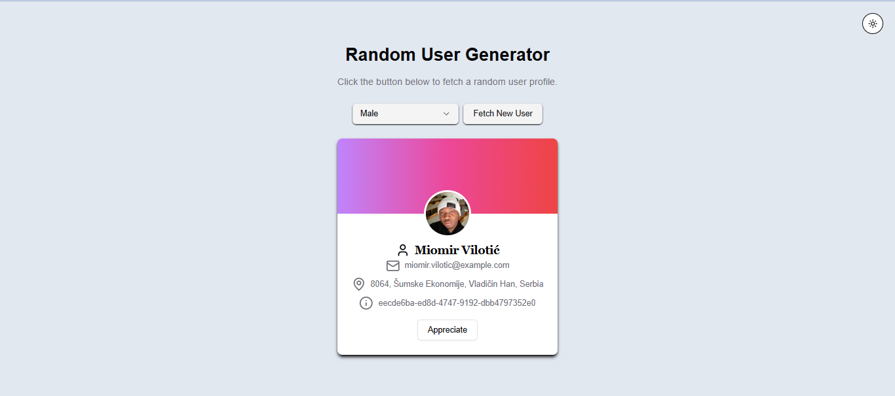
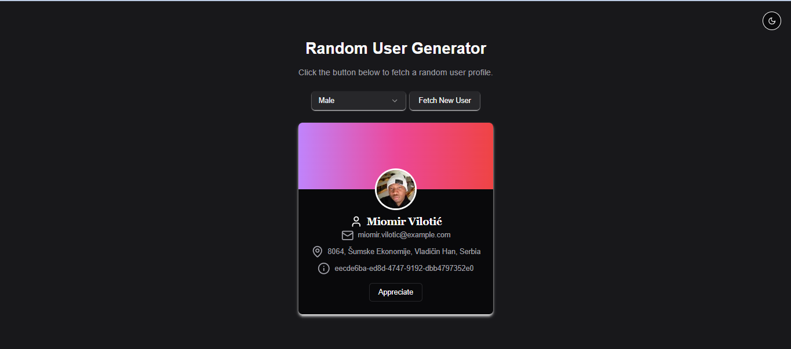

# Random User Generator

A feature-rich **Random User Generator** application built using modern technologies like **ShadCN**, **Next.js**, **Tailwind CSS**, **React**, and a public **API** ([randomuser.me](https://randomuser.me)).

This app allows users to fetch random user profiles, filter users by gender, and toggle between **light** and **dark themes** for a better user experience.

---

## 🚀 Features

- **Random User Profiles**: Fetch random user profiles with detailed information (name, email, address, description).
- **Gender Filter**: Select between "Male," "Female," or "Any" to customize the fetched user profiles.
- **Theme Toggle**: Switch between light and dark themes for an improved UI experience.
- **Responsive Design**: Optimized for devices of all screen sizes.
- **Appreciation Feature**: Show appreciation for the fetched user with a fun animated message.

---

## 🛠️ Built With

- **[ShadCN](https://shadcn.dev/)**: For pre-styled components.
- **[Next.js](https://nextjs.org/)**: React framework for server-side rendering and static site generation.
- **[Tailwind CSS](https://tailwindcss.com/)**: For building a beautiful and responsive user interface.
- **[React](https://reactjs.org/)**: For building the component-based user interface.
- **[randomuser.me API](https://randomuser.me/)**: For fetching user data.
- **[React Transition Group](https://reactcommunity.org/react-transition-group/)**: For smooth animations.

---

## 📸 Screenshots




---

## 🧰 Installation and Setup

1. Clone the repository:

   ```bash
   git clone https://github.com/Sheikh-Muhammad-Mujtaba/random-user-generator.git
   cd random-user-generator
   ```

2. Install dependencies:

   ```bash
   npm install
   ```

3. Start the development server:

   ```bash
   npm run dev
   ```

4. Open your browser at `http://localhost:3000` to view the app.

---

## 🖼️ Usage

### Fetch Random User
- Click the **Fetch New User** button to load a random user profile.
  
### Filter Users by Gender
- Use the dropdown to select a gender (`Any`, `Male`, or `Female`).
- Fetch new profiles based on your selection.

### Theme Toggle
- Switch between light and dark themes using the theme toggle button.

---

## 🙌 Acknowledgments

- Thanks to **[randomuser.me](https://randomuser.me)** for providing free user data.
- Shoutout to the creators of **ShadCN**, **Next.js**, **Tailwind CSS**, and **React** for their amazing tools.
